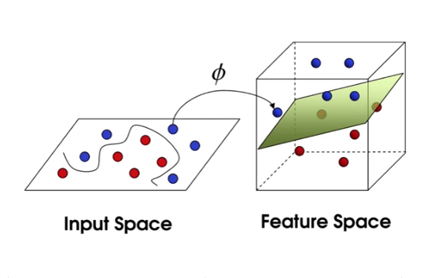

# Docker Python源码加密

&nbsp;

## SJL

- **Docker：** 简单理解是一种开源的虚拟机技术，虽然和我们传统意义上的虚拟机不太一样，比较轻量。
  - 和传统虚拟机的最大区别是，传统虚拟机是在一个操作系统上跑一个虚拟机软件，然后在软件里面跑一个完整的操作系统。Linux启动到最后会挂载一个文件系统，我们在这个用户空间里面去操作。Docker原理就是新挂载这么一个新的文件系统，和当前操作系统共用一个内核空间。
  - 两个比较主要的概念就是镜像和容器，镜像可以由我们自己制作。它们之间的关系可以看做面向对象编程中的类和实例。这样的好处是，跟在一个系统下我们可以起很多个终端一样，我们可以同时起很多个docker。
  - 主要应用场景是，保证开发环境和部署环境的一致性。举个更具体的应用例子，日常中可能一个人要搞好几套代码。每套代码编译时，对工具链、环境的要求都不一样，甚至可能会有冲突的。我们又不可能给每个人在好几台环境不一样的服务器上都开帐号，资源不允许。所以可以在一台服务器中放多个docker镜像。用户通过进docker，在里面编译，就能比较好解决这个问题。启动和挂载、退出，基本都是几秒搞定。
  - 对于普通使用者来说，自己制作镜像可能需要一定精力和学习。不过有很多已经做好的镜像可以用，仅仅只是使用docker的话就很容易了。

&nbsp;

- **Python源码加密：**
  
  - 可选方案
    - **pyc：** 门槛最低、也是网上找Python源码加密最容易找到的一种方式，平时运行的时候，也可能生成这种pyc文件。其实就是python一种根据相应的解释器版本生成的文件，可以优化运行速度。但破解门槛也非常低，目前已经有非常成熟的方法把它变回代码了，一个命令就能搞定那种。
      ```shell
      python3 -m compileall <src>
      ```
    - **代码混淆：** 这……很像那种C最难读懂代码比赛写出来的代码，有一些工具可以把你源码转得很难读。更加明显的然并卵，别人跑一下变成pyc，然后和上面一样就能拿到源码了。
    - **cython：** 这个比较有趣，它是先把Python代码转为C代码，然后就可以编译了。这样最终生成的东西，要破解就是汇编层面的东西了，相信我写的破代码和那个帐户密码还是没几个人会费心费力去干这事的。缺点也有，因为是C代码编译生成的，Python随处可用的特性就没了，换个环境，可能就要做针对性的重新编译；另外就是有可能转C代码失败，但我用了一段时间发现还好，至少比较常用的Python库都不会出现失败的情况，大不了只加密部分关键代码也行。
    - **解释器改造：** 这个门槛比较高，过程和部署也比较麻烦，但安全性最高。比起上面的奇技淫巧，这个才是真正的加密。原理是通过RSA之类的非对称加密来实现，Python是开源的，那么我们就能通过源码去改造解释器。直接在解释器里面加一key去解密代码，再写个工具加密代码。
    
  - 我最后是选了第三种cython，因为能基本解决安全问题、也容易实现；不像第四种，麻烦不说、还要去部署环境。
  
  - 然后我就写了一个shell工具脚本，实现功能大概是能够把一个文件 or 一整个Python项目目录 or 当前目录整体编译一遍。保证目录结构不变，但py文件全部变成 .so文件。留一个明文Python脚本做入口去import和调用那些so文件。
  
  ## 金石201
  
  **因果关系**
  
  自从9月中旬，正式确定做因果关系。老师给我安排的是侧重因果关系中的结构学习
  9月上旬阅读了人工智能领域中23个方向的论文，基本都是看一下概要，大概知道做什么的。
  如主动学习，潜移学习，医疗影像处理，强化学习，图网络，NLP等等的这些可能是现在深度学习发展的主要东西了。
  因果关系领域，接触的人几乎很少，国际上也就几个团队在做，与其说它是科学，不如说是一门艺术哲学
  用最简单的一个例子来讲，给定两组数据，吸烟，和肺癌。你如何知道到底是吸烟导致肺癌，还是肺癌导致吸烟呢？
  它们之间存在因果关系。因果关系容易混淆的是相关关系，例如吸烟，肺癌，和黄牙。
  站在我们认识到的角度来看，吸烟和肺癌有因果关系，但是肺癌和黄牙顶多算相关关系，而不是因果关系。
  所以因果关系的重要性就是在这里的：你做一个干预（因果关系的术语，可以认为是做某个action），是否会导致某个结果改变
  所以用doller的原话说，因果关系不是一个推理过程，而是一个存在于现实世界的关系
  至于现在科学上如何研究因果关系，答案是用图，图网络，概率图，结合着其他诸如深度学习的技术在做。
  
  **因果方向**
  
  因果关系最难的问题之一在于，你如何确定因果方向。给你两个数据，吸烟和肺癌。你如何确定吸烟--》肺癌。
  所以这也是因果关系中比较头疼的问题，因果关系的确认，就涉及到用概率统计中的独立性检测了。
  最早提出方向确认的方法是V-structure，它能确定3个节点之间的方向。但是它也存在很明显的缺陷。就是非V结构无法检测
  在因果关系中，提出的模型有诸如DAG，有向无环图，代表是贝叶斯网。无环图如马尔可夫网等。还有带有时序的模型。
  状态空间模型SSM，基于关系的模型等等。咋们因果关系最关心的是有向边的图，所以因果关系学习出来的大多数是贝叶斯网。
  但当如果引入时间序列的时间，问题也会变得相应复杂起来。在认识的本质上，你认为时间也是影响事物发展的因素之一，那么
  因果关系中的方向，也需要考虑时间因素的。就有了TBN这样的带时间片的贝叶斯网。
  
  **隐变量和结构学习**
  
  因果关系中第二个难题是隐变量。继续举上面的吸烟例子。你觉得吸烟导致肺癌，那么真的是吸烟导致肺癌吗？
  我们观察到，吸烟的人在肺里存在大量的焦油，所以焦油变质导致肺癌。于是关系就成了吸烟——》焦油——》肺癌
  但是如果我们只有吸烟和肺癌的数据，你怎么得到焦油这个数据节点呢？
  这个就是隐变量。在现实世界中，有很多的事物之间的关系我们是不知道的，它们之间是否存在中间变量（隐变量），我们也是不知道的
  如何确定这个隐变量。也是很复杂的问题。
  目前为止，对于因果方向的确定，有如PC算法，或者ANM算法，还有我们实验室自己提出来的两个改进的算法，都是因果关系中最前沿的方向确定算法，其中，实验室老师提出来的改进的高维空间因果方向确定的算法，直接证明了在它高维空间下，关系方向确认是NP问题，并且只能存在近似解，这一点同时使得这个问题的研究已经到了头，也就是说，后人无法再发表用传统这些算法来求因果方向的论文的（这也是实验室老师的牛逼之处）
  而对于隐变量求解，方法不是特别多，也仍然在发展，例如可以假设隐变量之间存在变量消除的作用，就例如焦油中存在某致癌物A才是导致肺癌的，那么我们就可以忽略焦油这个变量，认为仍然是吸烟——》A物质——》肺癌。
  或者通过假设解空间中有小于3个隐变量，然后依次建模。最后求出最好的。还有其他更牛逼的方法，我还没学习到。
  讲了这么多，如果求因果，就是如何确定图网络。确定图网络，主要就是使用独立性测试。
  对于学习到的这些知识的个人见解如下：
  因果关系站在纯粹的科学角度看是解释不清的，它涉及到的知识很广，有时候一个关系之间的解释就可以有多种（如等价图）
  但是如何找到我们要的正确图一直都是难题。但是从另外一个方面考虑，在不同的空间中一个事物的表现形式兴许不同，它们
  在本空间中的表示都是正确的，现在在科学家只是站在它们自己所认识到的角度上来看待这个问题，也就是在它们这个层次上的
  这套理论来解释因果是有一定作用的，但是未必要被局限在它们表示因果的认识上。
  例如我认为事物不仅仅能被用属性作为维度来描述。时间空间也许也许也是事物的某个因素。而属性还能分解成更加详细的属性。
  就好比分子可以被分解成原子，原子还能被分解。但是我们观察到的只是这个分子空间的事物变化形式。
  是否存在某种表示因果的方式，可以探索这种“另外空间”的事物表示形式及其之间的关系，之后再转化成我们现有空间的形式呢？
  这是我在书中注下的一句话。
  
  ## KDLin
  
  **OneNote天下第一**。
  **卷积神经网络**，卷积是一种按方块计算权重的方式，方块叫做卷积核，相当于滑动窗口。可以捕获空间的特征，比如图像。
  循环神经网络，捕获时序特征，需要捕获先后顺序的上下文关系，可以使用，比如文本理解。
  **统一的视角**，一个模型分为解码部分和编码部分，解码部分会将对象解码成很多很多特征，编码部分会根据你设计的输出构成你的目标。
  然而这些其实就那样，现有的例子都是很理想的情况，比如图像处理方面，文本分类方面，具体问题的时候经常过拟合，调参、正则化都不一定有用，经常法子用尽才能有一点点进步，每个法子都能解释成有用，但正的有用的太难找，不好控制变量，所以很麻烦。
  还有一个，模型就那些，数据预处理可能占了百分之七十，分析数据，不会。很多模型之间差距太小了，高质量数据量一上来，全都表现很好。整出一个复杂无比的模型提升一丁点，没什么用。
  **支持向量机**，基本模型是解决二分类问题。是一套复杂的理论，发展了很久，一开始很简单。现代支持向量机，基本思想就是二维空间很难分类就投影到高维空间去。主要难点是如何搞定高维空间，解决方案是核函数，低维计算统一高维空间。
  
  
  
  **主成分分析**，数学建模，在实验室三天肝了三天，看论文复现的主成分分析，多维特征降维的技术，方便聚类。结果发现这个是机器学习的内容，然后就同一套问题同一个方法。写论文的老哥，太佛系，最后论文也是凑出来的。
  **SDN网络**，可编程网络，传统网络中结构太简单，只用icmp协议控制报文，并且只是通过节点之间传话来控制网络。可编程网络是在网络中增加一个控制器，负责得到网络的拓扑等等信息，决定网络的转发。控制器可以对网络流进行各种控制，有一定的编程空间。现在数据中心都用的这东西。
  **边缘计算**，云计算中心服务器承载太大，边缘计算相当于多个小的服务中心，小服务中心和中心服务器之间的协同。例如无人车行驶过一条公路，可能要经过两个边缘服务器，于是边缘服务器选择，计算任务迁移。
